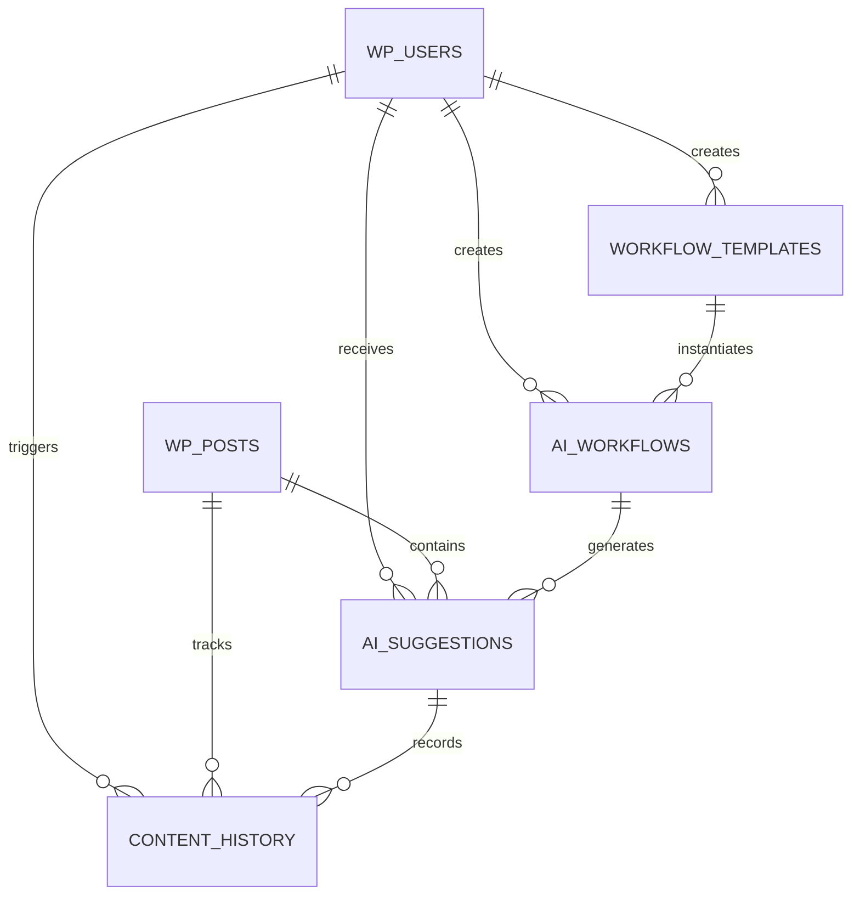

# Data Model: WordPress AI Content Workflow Plugin

## Entity Definitions

### Content Workflow
**Purpose**: Represents automated processes for content creation, editing, and approval with AI assistance

**WordPress Database Table**: `wp_ai_workflows`
```sql
CREATE TABLE wp_ai_workflows (
    id BIGINT(20) UNSIGNED NOT NULL AUTO_INCREMENT,
    name VARCHAR(255) NOT NULL,
    description TEXT,
    ai_provider VARCHAR(50) NOT NULL,
    settings LONGTEXT NOT NULL, -- JSON configuration
    status ENUM('active', 'inactive', 'archived') DEFAULT 'active',
    user_id BIGINT(20) UNSIGNED NOT NULL, -- Creator/owner
    created_at DATETIME DEFAULT CURRENT_TIMESTAMP,
    updated_at DATETIME DEFAULT CURRENT_TIMESTAMP ON UPDATE CURRENT_TIMESTAMP,
    PRIMARY KEY (id),
    FOREIGN KEY (user_id) REFERENCES wp_users(ID) ON DELETE CASCADE,
    INDEX idx_status (status),
    INDEX idx_provider (ai_provider),
    INDEX idx_user (user_id)
);
```

**Fields**:
- `id`: Unique workflow identifier
- `name`: Human-readable workflow name
- `description`: Optional workflow description
- `ai_provider`: AI service provider (openai, anthropic, etc.)
- `settings`: JSON configuration for AI parameters, prompts, and rules
- `status`: Current workflow state
- `user_id`: WordPress user who created the workflow
- `created_at/updated_at`: Timestamp tracking

**Validation Rules**:
- Name must be 1-255 characters, unique per user
- AI provider must be from supported list
- Settings must be valid JSON
- User must exist in wp_users table

**State Transitions**:
- active → inactive (user disables)
- inactive → active (user enables)
- active/inactive → archived (user archives)

### AI Suggestion
**Purpose**: Represents AI-generated content recommendations with original text reference and user response

**WordPress Database Table**: `wp_ai_suggestions`
```sql
CREATE TABLE wp_ai_suggestions (
    id BIGINT(20) UNSIGNED NOT NULL AUTO_INCREMENT,
    post_id BIGINT(20) UNSIGNED NOT NULL,
    workflow_id BIGINT(20) UNSIGNED NOT NULL,
    user_id BIGINT(20) UNSIGNED NOT NULL,
    original_content LONGTEXT NOT NULL,
    suggested_content LONGTEXT NOT NULL,
    suggestion_type ENUM('generation', 'improvement', 'correction') NOT NULL,
    status ENUM('pending', 'accepted', 'rejected', 'modified') DEFAULT 'pending',
    confidence_score DECIMAL(3,2) DEFAULT NULL,
    metadata LONGTEXT, -- JSON for additional AI data
    created_at DATETIME DEFAULT CURRENT_TIMESTAMP,
    processed_at DATETIME NULL,
    PRIMARY KEY (id),
    FOREIGN KEY (post_id) REFERENCES wp_posts(ID) ON DELETE CASCADE,
    FOREIGN KEY (workflow_id) REFERENCES wp_ai_workflows(id) ON DELETE CASCADE,
    FOREIGN KEY (user_id) REFERENCES wp_users(ID) ON DELETE CASCADE,
    INDEX idx_post_workflow (post_id, workflow_id),
    INDEX idx_status (status),
    INDEX idx_user_status (user_id, status)
);
```

**Fields**:
- `suggestion_type`: Category of AI assistance provided
- `confidence_score`: AI confidence rating (0.00-1.00)
- `metadata`: Additional AI response data (tokens used, model version, etc.)
- `processed_at`: Timestamp when user acted on suggestion

**Validation Rules**:
- Post must exist and user must have edit permissions
- Workflow must be active
- Original and suggested content cannot be empty
- Confidence score must be between 0.00 and 1.00

**State Transitions**:
- pending → accepted (user approves)
- pending → rejected (user declines)
- pending → modified (user edits then accepts)

### Workflow Template
**Purpose**: Represents reusable workflow configurations with AI parameters and processing steps

**WordPress Database Table**: `wp_workflow_templates`
```sql
CREATE TABLE wp_workflow_templates (
    id BIGINT(20) UNSIGNED NOT NULL AUTO_INCREMENT,
    name VARCHAR(255) NOT NULL,
    category VARCHAR(100) NOT NULL,
    description TEXT,
    ai_parameters LONGTEXT NOT NULL, -- JSON
    processing_steps LONGTEXT NOT NULL, -- JSON array
    approval_criteria LONGTEXT, -- JSON rules
    is_public BOOLEAN DEFAULT FALSE,
    user_id BIGINT(20) UNSIGNED NOT NULL, -- Creator
    usage_count INT DEFAULT 0,
    created_at DATETIME DEFAULT CURRENT_TIMESTAMP,
    updated_at DATETIME DEFAULT CURRENT_TIMESTAMP ON UPDATE CURRENT_TIMESTAMP,
    PRIMARY KEY (id),
    FOREIGN KEY (user_id) REFERENCES wp_users(ID) ON DELETE CASCADE,
    INDEX idx_category (category),
    INDEX idx_public (is_public),
    INDEX idx_usage (usage_count DESC)
);
```

**Fields**:
- `category`: Template grouping (blog-posts, pages, social-media, etc.)
- `ai_parameters`: JSON with model settings, temperature, max_tokens, etc.
- `processing_steps`: Ordered array of AI operations to perform
- `approval_criteria`: Rules for auto-approval vs manual review
- `is_public`: Whether template is shared with other users
- `usage_count`: Track popularity for recommendations

**Categories**: blog-posts, pages, social-media, marketing-copy, technical-docs, creative-writing

### Content History
**Purpose**: Represents versioning and change tracking for AI-assisted content modifications

**WordPress Database Table**: `wp_ai_content_history`
```sql
CREATE TABLE wp_ai_content_history (
    id BIGINT(20) UNSIGNED NOT NULL AUTO_INCREMENT,
    post_id BIGINT(20) UNSIGNED NOT NULL,
    suggestion_id BIGINT(20) UNSIGNED NULL, -- NULL for manual edits
    user_id BIGINT(20) UNSIGNED NOT NULL,
    content_before LONGTEXT NOT NULL,
    content_after LONGTEXT NOT NULL,
    change_type ENUM('ai_generated', 'ai_improved', 'manual_edit', 'ai_rejected') NOT NULL,
    diff_data LONGTEXT, -- JSON with detailed change information
    revision_number INT NOT NULL,
    created_at DATETIME DEFAULT CURRENT_TIMESTAMP,
    PRIMARY KEY (id),
    FOREIGN KEY (post_id) REFERENCES wp_posts(ID) ON DELETE CASCADE,
    FOREIGN KEY (suggestion_id) REFERENCES wp_ai_suggestions(id) ON DELETE SET NULL,
    FOREIGN KEY (user_id) REFERENCES wp_users(ID) ON DELETE CASCADE,
    INDEX idx_post_revision (post_id, revision_number),
    INDEX idx_change_type (change_type),
    INDEX idx_created (created_at DESC)
);
```

**Fields**:
- `diff_data`: Detailed change tracking (word count, character changes, semantic changes)
- `revision_number`: Sequential version number for the post
- `change_type`: Source and nature of the content modification

### User Preferences
**Purpose**: Individual user settings for AI behavior, workflow participation, and content preferences

**WordPress Implementation**: Extends wp_usermeta table
```php
// Meta keys used in wp_usermeta:
'ai_content_flow_preferences' => JSON settings
'ai_content_flow_enabled_workflows' => array of workflow IDs
'ai_content_flow_ui_settings' => JSON UI configuration
```

**Preference Structure** (JSON in wp_usermeta):
```json
{
  "ai_settings": {
    "default_provider": "openai",
    "auto_apply_suggestions": false,
    "confidence_threshold": 0.8,
    "max_suggestions_per_session": 10
  },
  "workflow_settings": {
    "enabled_workflows": [1, 3, 5],
    "auto_run_workflows": [1],
    "notification_preferences": {
      "email_on_suggestions": true,
      "browser_notifications": false
    }
  },
  "ui_settings": {
    "show_confidence_scores": true,
    "suggestion_display_mode": "inline",
    "collapsed_panels": ["history"]
  }
}
```

## Entity Relationships



## WordPress Integration

### Custom Post Type Registration
```php
// Register workflow templates as custom post type for better WordPress integration
register_post_type('ai_workflow_template', [
    'public' => false,
    'show_ui' => true,
    'show_in_admin_menu' => false,
    'capability_type' => 'post',
    'supports' => ['title', 'editor', 'author']
]);
```

### Meta Box Integration
```php
// Add AI workflow meta boxes to post edit screens
add_meta_box(
    'ai_content_suggestions',
    'AI Content Suggestions',
    'render_ai_suggestions_metabox',
    ['post', 'page'],
    'side',
    'high'
);
```

## Data Validation Rules

1. **Content Length Limits**:
   - Workflow names: 1-255 characters
   - Content fields: Max 65,535 characters (LONGTEXT)
   - AI provider names: Max 50 characters

2. **Foreign Key Constraints**:
   - All user_id references must exist in wp_users
   - All post_id references must exist in wp_posts
   - Workflow references must exist and be active

3. **Business Logic Validation**:
   - Users can only edit their own workflows (unless admin)
   - AI suggestions require edit_posts capability for the target post
   - Workflow templates can be public only if user has publish_posts capability

4. **Data Integrity**:
   - JSON fields must contain valid JSON
   - Enum fields must match defined values
   - Confidence scores must be between 0.00 and 1.00

This data model supports all functional requirements while maintaining WordPress compatibility and performance optimization through proper indexing and relationships.